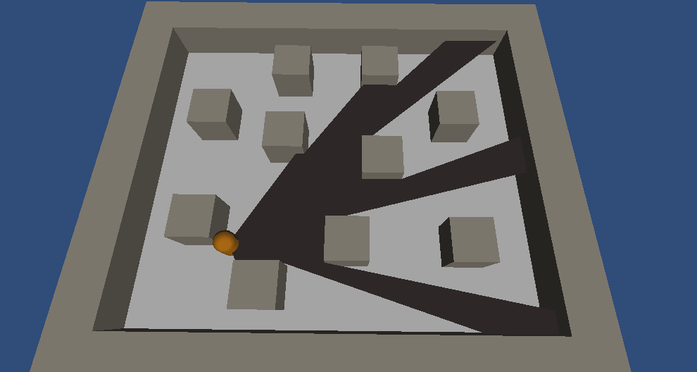
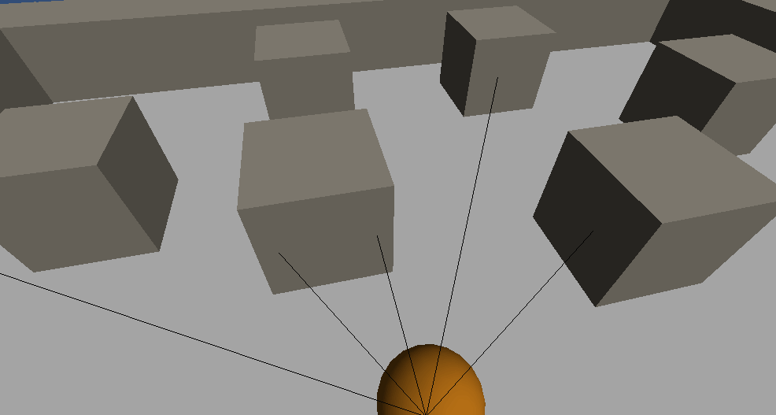

Unity - Line of sight mesh generator
=================

##What is this ?

This piece of code generates a mesh representing the line of sight of a player in a real time 3D Unity Engine scene.

A picture is worth a thousand words:

##How does it works ?

Since this raycasting script focusses on outer edges detection, it works best with angular objects.

First, let's say we cast 20 rays. Then we compare each pair of rays: if they hit a different scene object, we cast 20 other rays between these 2 rays and so on in a recursive way. When we are done (or we reached the number of maximum iterations), we generate a mesh with all the rays hitpoints using a [triangulation algorithm](http://wiki.unity3d.com/index.php?title=Triangulator).

*From the first to the last iteration of raycasting algorithm, the the mesh is generated from the hitpoints*

Note: your scene must be closed or it won't work! (the rays must hit something sometime)

##Try it!

Check out the demo Unity Package in the samples folder to try it yourself.

